<div align="center">

# 🗑️ Waste Classification System

### Intelligent Waste Sorting Using YOLOv11 Deep Learning

[](https://www.python.org/downloads/)
[](https://docs.ultralytics.com/)
[](https://streamlit.io/)
[](LICENSE)

**An end-to-end Machine Learning pipeline for classifying waste into Organic and Recyclable categories**

[🚀 Quick Start](#-quick-start) • [📖 Documentation](#-documentation) • [🎯 Demo](#-demo) • [📊 Results](#-results)

</div>

---

## 📋 Table of Contents

- [Problem Statement](#-problem-statement)
- [Solution Approach](#-solution-approach)
- [Project Architecture](#-project-architecture)
- [Dataset](#-dataset)
- [Installation](#-installation)
- [Quick Start](#-quick-start)
- [Project Structure](#-project-structure)
- [Notebooks Guide](#-notebooks-guide)
- [Math From Scratch](#-math-from-scratch)
- [Streamlit Application](#-streamlit-application)
- [Learning Resources](#-learning-resources)
- [Contributing](#-contributing)

---

## 🌍 Problem Statement

Waste management is a critical environmental challenge. Most waste ends up in landfills, causing:

| Issue | Impact |
|-------|--------|
| 🏗️ Increase in Landfills | Space constraints, land degradation |
| 🌊 Eutrophication | Water body pollution, algal blooms |
| 🦎 Toxic Consumption | Wildlife health hazards |
| 💧 Leachate | Groundwater contamination |
| ☠️ Toxin Increase | Air and soil pollution |

---

## 💡 Solution Approach

This project implements an **AI-powered Waste Classification System** that:

1. **Automatically classifies** waste images into **Organic** or **Recyclable** categories
2. Uses **YOLOv11**, the state-of-the-art object detection model
3. Provides a **user-friendly Streamlit interface** for real-time predictions
4. **Implements core ML concepts from scratch** using NumPy
5. Follows **Martin Zinkevich's 43 Rules of ML Engineering**

```
📸 Input Image → 🧠 YOLOv11 Model → 🏷️ Classification → ♻️ Action
```

---

## 🏗️ Project Architecture

```mermaid
graph LR
    A[📁 Raw Data] --> B[🔄 Preprocessing]
    B --> C[📊 YOLO Format]
    C --> D[🧠 YOLOv11]
    D --> E[📈 Training]
    E --> F[✅ Evaluation]
    F --> G[🚀 Deployment]
    G --> H[🖥️ Streamlit App]
```



### Key Components

| Component | Technology | Purpose |
|-----------|-----------|---------|
| **Data Pipeline** | Python, NumPy, OpenCV | Image preprocessing & augmentation |
| **Model** | YOLOv11 (Ultralytics) | Object detection & classification |
| **Training** | Jupyter Notebooks | Experimentation & development |
| **Deployment** | Streamlit | Production-ready web application |
| **Math Implementation** | NumPy | Educational foundations from scratch |

---

## 📊 Dataset

**Source**: [Kaggle - Waste Classification Data](https://www.kaggle.com/datasets/techsash/waste-classification-data)

| Split | Images | Description |
|-------|--------|-------------|
| Training | 22,564 | 85% of total data |
| Validation | 2,513 | 15% of total data |

### Classes

| Class | Label | Examples |
|-------|-------|----------|
| 🥬 **Organic** | 0 | Food waste, leaves, plants, paper |
| ♻️ **Recyclable** | 1 | Plastic, metal, glass, cardboard |

---

## 🛠️ Installation

### Prerequisites

- Python 3.9+
- CUDA-capable GPU (recommended)
- Git

### Setup

```bash
# Clone the repository
git clone https://github.com/yourusername/YOLO-V11-PRO.git
cd YOLO-V11-PRO

# Create virtual environment
python -m venv venv

# Activate virtual environment
# Windows
.\venv\Scripts\activate
# Linux/Mac
source venv/bin/activate

# Install dependencies
pip install -r requirements.txt
```

---

## 🚀 Quick Start

### 1. Download Dataset

```bash
# Using Kaggle API
kaggle datasets download -d techsash/waste-classification-data
unzip waste-classification-data.zip -d data/raw/
```

### 2. Run Notebooks (In Order)

```bash
jupyter notebook notebooks/
```

See [Notebooks Guide](#-notebooks-guide) for details.

### 3. Train Model

```python
from ultralytics import YOLO

model = YOLO('yolo11n.pt')
model.train(data='data/processed/dataset.yaml', epochs=100)
```

### 4. Run Streamlit App

```bash
cd streamlit_app
streamlit run app.py
```

---

## 📁 Project Structure

```
YOLO-V11-PRO/
├── 📁 data/
│   ├── raw/                      # Original dataset
│   └── processed/                # YOLO-formatted data
│       ├── images/
│       │   ├── train/
│       │   └── val/
│       ├── labels/
│       │   ├── train/
│       │   └── val/
│       └── dataset.yaml
│
├── 📁 notebooks/                  # Development notebooks
│   ├── 01_data_exploration.ipynb
│   ├── 02_data_preprocessing.ipynb
│   ├── 03_yolo_format_conversion.ipynb
│   ├── 04_data_visualization.ipynb
│   ├── 05_cnn_fundamentals.ipynb
│   ├── 06_detection_metrics.ipynb
│   ├── 07_yolo_architecture.ipynb
│   ├── 08_loss_functions.ipynb
│   ├── 09_yolov11_setup.ipynb
│   └── 10_model_training.ipynb
│
├── 📁 src/
│   └── math_from_scratch/         # NumPy implementations
│       ├── __init__.py
│       ├── convolution.py         # 2D convolution
│       ├── activations.py         # ReLU, SiLU, Softmax
│       ├── pooling.py             # Max/Avg pooling
│       ├── metrics.py             # IoU, NMS, mAP
│       └── losses.py              # BCE, Focal, CIoU
│
├── 📁 models/                     # Trained model weights
│   └── waste_yolo11n_*/
│       └── weights/
│           ├── best.pt
│           └── last.pt
│
├── 📁 streamlit_app/              # Deployment app
│   ├── app.py
│   ├── README.md
│   └── .streamlit/
│       └── config.toml
│
├── 📁 docs/                       # Documentation
│   ├── CODE-THEORY.md             # Code ↔ Theory linkage
│   ├── SYSTEM_DESIGN.md           # Architecture design
│   └── assets/                    # Images and diagrams
│
├── 📁 configs/                    # Training configs
│   └── train_config.yaml
│
├── 📁 tests/                      # Unit tests
├── .gitignore
├── LICENSE
├── requirements.txt
└── README.md
```

---

## 📓 Notebooks Guide

| # | Notebook | Phase | Description |
|---|----------|-------|-------------|
| 01 | `data_exploration.ipynb` | Data Prep | Dataset analysis, class distribution, EDA |
| 02 | `data_preprocessing.ipynb` | Data Prep | Resizing, normalization, augmentation (NumPy) |
| 03 | `yolo_format_conversion.ipynb` | Data Prep | Convert to YOLO format, create labels |
| 04 | `data_visualization.ipynb` | Data Prep | Advanced EDA, heatmaps, statistics |
| 05 | `cnn_fundamentals.ipynb` | Theory | Convolution, activations, pooling (NumPy) |
| 06 | `detection_metrics.ipynb` | Theory | IoU, NMS, Precision, Recall, mAP (NumPy) |
| 07 | `yolo_architecture.ipynb` | Theory | Backbone, Neck, Head architecture |
| 08 | `loss_functions.ipynb` | Theory | BCE, Focal Loss, CIoU (NumPy) |
| 09 | `yolov11_setup.ipynb` | Training | Ultralytics setup, configuration |
| 10 | `model_training.ipynb` | Training | Full training pipeline |

---

## 🧮 Math From Scratch

All core concepts implemented using **only NumPy**:

### CNN Components (`src/math_from_scratch/`)

| Module | Implementations |
|--------|----------------|
| `convolution.py` | 2D convolution, Sobel, Gaussian kernels |
| `activations.py` | Sigmoid, Tanh, ReLU, Leaky ReLU, SiLU, Softmax |
| `pooling.py` | Max pooling, Avg pooling, Global Avg pooling |
| `metrics.py` | IoU, NMS, Precision, Recall, AP, mAP |
| `losses.py` | BCE, Focal Loss, CIoU, YOLO Loss |

### Key Formulas Implemented

| Concept | Formula |
|---------|---------|
| **IoU** | `Intersection / Union` |
| **NMS** | Iterative box suppression by IoU threshold |
| **CIoU** | `IoU - ρ²/c² - αv` |
| **Focal Loss** | `-α(1-p_t)^γ log(p_t)` |

---

## 🖥️ Streamlit Application

The web application provides:

- 📤 **Image Upload**: Upload waste images for classification
- 📸 **Camera Input**: Real-time webcam classification
- ⚙️ **Confidence Slider**: Adjust detection threshold
- 📊 **Styled Results**: Color-coded predictions with confidence

### Run the App

```bash
cd streamlit_app
streamlit run app.py
```

Opens at: `http://localhost:8501`

---

## 📚 Learning Resources

### Code-Theory Linkage

See **[docs/CODE-THEORY.md](docs/CODE-THEORY.md)** for detailed explanations linking:
- Mathematical formulas to code
- Theory concepts to implementations
- References for further learning

### External Resources

| Topic | Resource |
|-------|----------|
| **CNN Basics** | [CS231n Stanford](https://cs231n.github.io/) |
| **YOLO Architecture** | [Original YOLO Paper](https://arxiv.org/abs/1506.02640) |
| **YOLOv11** | [Ultralytics Docs](https://docs.ultralytics.com/) |
| **Object Detection** | [PyImageSearch](https://pyimagesearch.com/) |

---

## 🔬 ML Engineering Rules Applied

This project follows **Martin Zinkevich's 43 Rules of Machine Learning**:

| Phase | Rules | Implementation |
|-------|-------|---------------|
| **Phase 0** | #1, #2, #3 | Start simple, define metrics |
| **Phase I** | #4, #5, #14 | Simple model, test infrastructure |
| **Phase II** | #16, #17, #24 | Iterate, use observed features |
| **Phase III** | #29, #30 | Deploy, monitor |

---

## 🤝 Contributing

Contributions are welcome! Please:

1. Fork the repository
2. Create your feature branch (`git checkout -b feature/AmazingFeature`)
3. Commit your changes (`git commit -m 'Add AmazingFeature'`)
4. Push to the branch (`git push origin feature/AmazingFeature`)
5. Open a Pull Request

---

## 📄 License

This project is licensed under the MIT License - see the [LICENSE](LICENSE) file for details.

---

<div align="center">

### ⭐ Star this repository if you found it helpful!

**Made with ❤️ for Environmental Sustainability**

</div>
